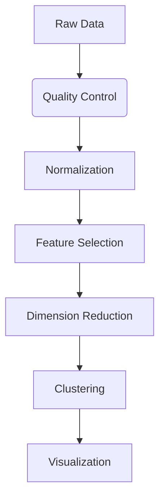

# RNA-seq-Reanalysis
# 🧠 NeuroCell Explorer  
*Single-Cell RNA-seq Reanalysis of Human Brain Cells*  

[](https://python.org)
[](https://scanpy.readthedocs.io)

  
*Interactive exploration of human brain cell transcriptomics*

---

## 📜 Project Overview

NeuroCell Explorer is an interactive platform for exploring transcriptional diversity in human brain cells, reproducing and enhancing the findings from the landmark Darmanis et al. (2015) study using modern computational pipelines.

**Key Features:**
- 🎨 Interactive UMAP visualizations
- 🔍 Gene expression profiling
- 🧬 Cluster comparison tools
- 📊 Dynamic plotting with Plotly.js

**Dataset Specifications:**
| Property | Value |
|----------|-------|
| GEO Accession | [GSE67835](https://www.ncbi.nlm.nih.gov/geo/query/acc.cgi?acc=GSE67835) |
| Technology | Smart-seq2 |
| Samples | 466 single cells |
| Tissue Source | Adult and fetal human brain |

---

## 🔬 Analysis Pipeline



### 1. Data Processing
- **Quality Control**  
  ✓ Cells with ≥200 genes retained  
  ✓ Genes present in ≥3 cells kept  
  ✓ Mitochondrial content filtering

- **Normalization**  
  ✓ Total-count normalization  
  ✓ log1p transformation  
  ✓ HVG selection (top 2,000 genes)

### 2. Computational Analysis
- **Dimension Reduction**  
  ✓ PCA (50 components)  
  ✓ UMAP embedding (n_neighbors=15, min_dist=0.1)

- **Clustering**  
  ✓ kNN graph construction  
  ✓ Leiden algorithm (resolution=0.6)  
  ✓ Identified 13 distinct clusters

---

## 🖥️ Web Interface Features

### Gene Explorer
```python
# Example search
search_gene("SOX2")  # Neural progenitor marker
search_gene("GFAP")  # Astrocyte marker
```

**Capabilities:**
- Expression heatmaps across clusters
- Violin plots of distribution
- UMAP highlighting by expression level

### Cluster Visualization


**View Options:**
- Color by cluster ID
- Color by cell type annotation
- Color by gene expression gradient

---

## 🗃️ Data Structure

```
RNA-seq-Reanalysis/
│
├── data/
│   ├── processed_data.h5ad          # Scanpy AnnData object
│   ├── umap_coordinates.json        # UMAP projections
│   └── normalized_counts.csv        # Expression matrix
│
├── src/                            # Analysis notebooks
│   ├── 1_data_processing.ipynb
│   ├── 2_analysis.ipynb
│   └── 3_visualization.ipynb
│
└── web/                            # Interactive app
    ├── static/                     # JS/CSS assets
    └── index.html                  # Main interface
```

---

## 🚀 Quick Start

1. Clone repository:
```bash
git clone https://github.com/Dheeraj-607/RNA-seq-Reanalysis.git
cd RNA-seq-Reanalysis
```

2. Install dependencies:
```bash
pip install -r requirements.txt
```

3. Launch Jupyter Lab:
```bash
jupyter lab
```

---

## 👨‍💻 Author  
**Dheeraj**  
📧 *MSc Bioinformatics Candidate*  
🏛 *University of Leicester, 2025*  

[](https://github.com/Dheeraj-607)

---

<div align="center">
  <sub>Built with ❤️ by Dheeraj  </sub>
</div>
